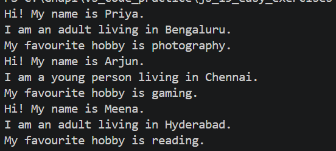

# Exercise 1: Template Literal Greeting Card

## 📌 Problem

Create a JavaScript function that takes a person's name, age, city, and hobby, and returns a formatted introduction using template literals.

## 💡 Approach

* Store values using variables
* Use a function to generate output
* Use template literals for formatting
* Use a ternary operator to check if the person is an adult or a young person

## 🧠 Concepts Used

* Variables (const)
* Functions
* Template Literals (`${}`)
* Conditional (Ternary Operator)

## 💻 Code Explanation

* A function `introduce()` takes 4 parameters
* Inside the template literal, values are inserted using `${}`
* A condition checks age:

  * age >= 18 → "an adult"
  * else → "a young person"

## ▶️ How to Run

1. Open terminal
2. Navigate to folder:
   cd js_15_exercises/ex1
3. Run:
   node index.js

## 📤 Example Output

Hi! My name is Priya.
I am an adult living in Bengaluru.
My favourite hobby is photography.

## 📝 Notes

* Template literals make string formatting clean and readable
* Avoid using `+` for concatenation in modern JavaScript
