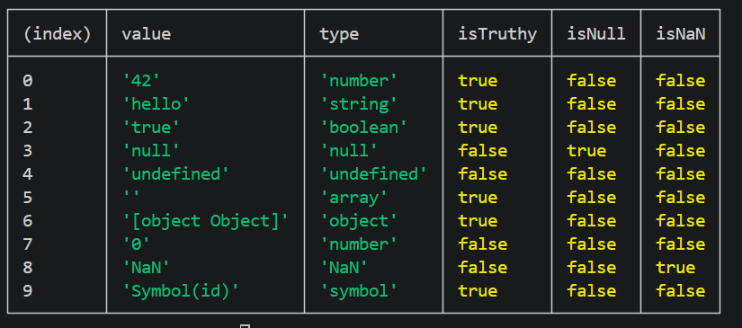

# Exercise 2: Type Checker Utility

## 📌 Problem

Create a function that identifies the correct type of a value and determines whether it is truthy, null, or NaN.

## 💡 Approach

* Use conditional checks to fix JavaScript type issues
* Handle special cases:

  * null
  * NaN
  * arrays
* Use typeof for remaining types

## 🧠 Concepts Used

* typeof
* Functions
* Conditions (if/else)
* Boolean conversion
* Array.isArray()
* Number.isNaN()

## 💻 Code Explanation

* `value === null` → fixes null bug
* `Number.isNaN(value)` → detects NaN correctly
* `Array.isArray(value)` → identifies arrays
* `Boolean(value)` → converts to true/false

## ▶️ How to Run

1. Open terminal
2. Navigate:
   cd js_15_exercises/ex2
3. Run:
   node index.js

## 📤 Example Output

Displayed using console.table() in a structured format.

## 📝 Notes

* typeof null returns "object" (JavaScript bug)
* Arrays are also objects → must be handled separately
* NaN is a special number → needs separate detection
