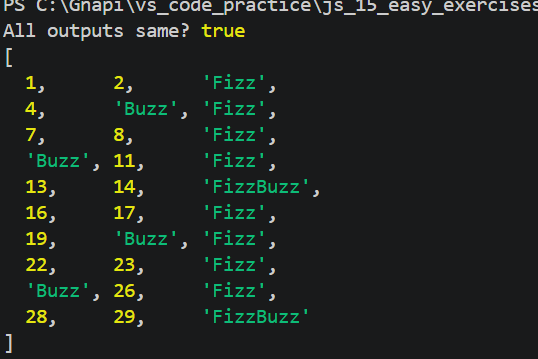

# Exercise 3: FizzBuzz with All 5 Loop Types

## 📌 Problem

Print numbers from 1 to 30 with:

* Multiples of 3 → "Fizz"
* Multiples of 5 → "Buzz"
* Multiples of both → "FizzBuzz"

Solve this using 5 different loop types and ensure all outputs are identical.

---

## 💡 Approach

* Create a reusable function `getFizzBuzz(n)` to avoid repeating logic
* Use different loop types to iterate from 1 to 30
* Store results in arrays
* Compare all outputs using `JSON.stringify()`

---

## 🧠 Concepts Used

* Loops (`for`, `while`, `do-while`, `for...of`, `for...in`)
* Conditions
* Arrays & Objects
* Functions

---

## 🔄 Loop Types Explained

### 1. for loop

Used when you need full control (start, end, increment)

```js
for (let i = 1; i <= 5; i++) {
  console.log(i);
}
```

---

### 2. for...of

Used for arrays — gives values directly

```js
const arr = [1, 2, 3];

for (const value of arr) {
  console.log(value);
}
```

---

### 3. for...in

Used for objects — gives keys (property names)

```js
const obj = { a: 1, b: 2 };

for (const key in obj) {
  console.log(key, obj[key]);
}
```

---

### ⚠️ Key Difference

| Loop     | Use Case     | Returns        |
| -------- | ------------ | -------------- |
| for      | Full control | index (manual) |
| for...of | Arrays       | values         |
| for...in | Objects      | keys           |

---

## 💻 Example (FizzBuzz Logic)

```js
function getFizzBuzz(n) {
  if (n % 3 === 0 && n % 5 === 0) return "FizzBuzz";
  if (n % 3 === 0) return "Fizz";
  if (n % 5 === 0) return "Buzz";
  return n;
}
```

---

## ▶️ How to Run

1. Open terminal
2. Navigate to folder:
   cd js_15_exercises/ex3
3. Run:
   node index.js

---

## 📤 Example Output

[1, 2, "Fizz", 4, "Buzz", ..., "FizzBuzz"]

---

## 📝 Notes

* Always check "FizzBuzz" condition first
* `for...of` is best for arrays
* `for...in` is used for objects
* All loop outputs must match
