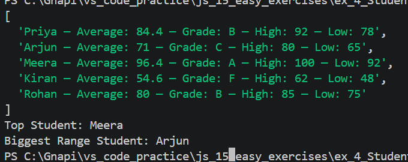

# Exercise 4: Student Report Card Generator

## 📌 Problem

Generate report cards for students using their scores and determine top and most varied performers.

## 💡 Approach

* Use functions to calculate average and grade
* Generate reports using map()
* Use reduce() to find:

  * top student (highest average)
  * biggest range (max - min)

## 🧠 Concepts Used

* Arrays & Objects
* Functions
* map(), reduce()
* Math functions (max, min)
* Spread operator (...)

## 💻 Code Explanation

* `getAverage()` calculates mean using reduce()
* `getGrade()` assigns grade based on score
* `generateReport()` formats student data
* `map()` generates all reports
* `reduce()` compares students

## 🔄 Key Methods Explained

### map()

* Runs a function on every element
* Returns a new array

Example:

```js
[1,2,3].map(x => x * 2); // [2,4,6]
```

---

### reduce()

* Reduces array to a single value

Example:

```js
[1,2,3].reduce((sum, x) => sum + x, 0); // 6
```

---

## ▶️ How to Run

1. Open terminal
2. Navigate:
   cd js_15_exercises/ex4
3. Run:
   node index.js

## 📤 Example Output

Priya — Average: 84.4 — Grade: B — High: 92 — Low: 78

Top Student: Meera

## 📝 Notes

* map() avoids manual loops
* reduce() is powerful for comparisons
* Spread operator simplifies max/min calculations
