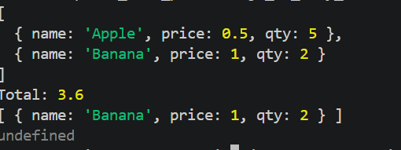

# Exercise 5: Shopping Cart with Closures

## 📌 Problem

Build a shopping cart where items are private and accessible only through functions.

## 💡 Approach

* Use a closure to keep `items` private
* Return functions to interact with the cart
* Prevent direct access to internal data

## 🧠 Concepts Used

* Closures
* Arrays
* Functions
* map(), reduce(), find()

## 🔐 What is a Closure?

A closure allows a function to access variables from its outer scope even after the outer function has finished executing.

Example:

```js
function outer() {
  let x = 10;
  return function inner() {
    console.log(x);
  };
}
```

---

## 💻 Code Explanation

* `items` is private inside `createCart()`
* `addItem()` adds or updates quantity
* `removeItem()` removes item safely
* `getTotal()` calculates total and applies discount
* `getItems()` returns a copy to avoid mutation

---

## ▶️ How to Run

1. Open terminal
2. Navigate:
   cd js_15_exercises/ex5
3. Run:
   node index.js

## 📤 Example Output

Items:
[{ name: "Apple", qty: 5 }, { name: "Banana", qty: 2 }]

Total after discount: 3.6

cart.items → undefined

## 📝 Notes

* Closures help protect data
* Spread operator prevents direct modification
* Good pattern for real-world apps
Total = 4.5
Discount = 20%
🔹 Step 1: Convert % to value
discount = (total * discountPercent) / 100

So:

(4.5 × 20) / 100
🔹 Step 2: Calculate
4.5 × 20 = 90  
90 / 100 = 0.9

 Discount = 0.9

🔹 Step 3: Final total
4.5 - 0.9 = 3.6
 Shortcut way (important)

Instead of doing 20%, think:

 20% = 0.2

4.5 × 0.2 = 0.9

Same result.

1. What is a Closure?
 Simple Meaning

A closure is when a function:
 remembers and uses variables from its outer function
 even after the outer function has finished

2. What is Spread Operator (...)?
 Meaning

 It expands an array into individual values
 UNDEFINED :
 3) Why cart.items is undefined
console.log(cart.items);

JavaScript checks:

Does cart have a property named items?

Answer:

No → returns undefined

There is no fallback to local variables of createCart