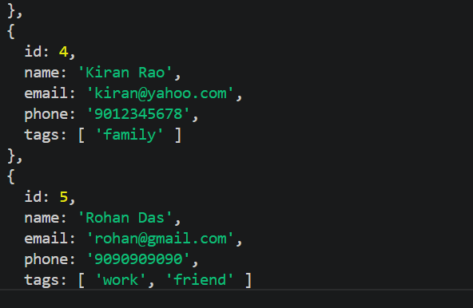
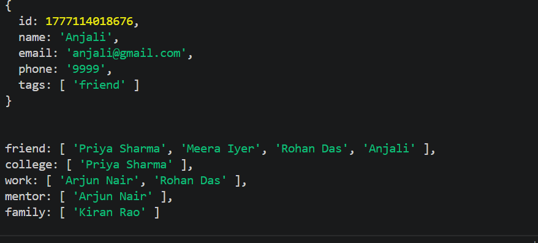

# Exercise 6: Contact Book — CRUD

## ◆ Problem

Build a contact book system using an array of objects and implement CRUD operations using array methods.

## ◆ Approach

* Store contacts as objects in an array
* Use:

  * map() → update
  * filter() → search & delete
  * reduce() → grouping
* Use spread operator to maintain immutability

## ◆ Concepts Used

* Arrays & Objects
* Destructuring
* Spread Operator (...)
* map(), filter(), reduce()

## ◆ Function Explanation

### addContact()

Adds a new contact with unique id

### searchContacts()

Searches name, email, and tags (case-insensitive)

### updateContact()

Updates contact using map() without modifying original array

### deleteContact()

Removes contact using filter()

### groupByTag()

Groups contacts based on tags using reduce()

## ◆ How to Run

1. Open terminal
2. Navigate:
   cd js_15_exercises/ex6
3. Run:
   node index.js

## ◆ Example Output

Search "gmail" returns all gmail users

Grouped:
{
friend: ["Priya","Meera","Rohan"],
work: ["Arjun","Rohan"]
}

## ◆ Notes

* No loops used — only array methods
* Spread operator prevents mutation
* Destructuring improves readability

