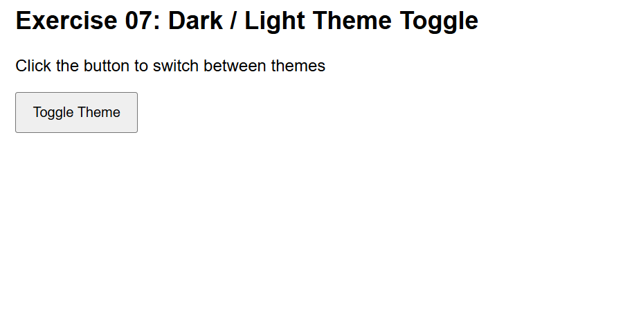
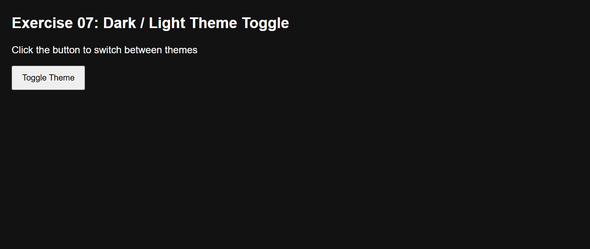

# Exercise 7: Dark / Light Theme Toggle

## ◆ Problem

Create a theme toggle that switches between dark and light mode and persists user preference using localStorage.

## ◆ Approach

* Use a button click event
* Toggle a class on the <html> element
* Save theme in localStorage
* Apply saved theme on page load

## ◆ Concepts Used

* DOM manipulation
* classList
* localStorage
* Event handling

## ◆ Code Explanation

### Theme Load

* Reads saved theme from localStorage
* Applies "dark" class if needed

### Toggle Logic

* classList.toggle("dark") switches theme
* Checks if class exists
* Saves current theme to localStorage

## ◆ How to Run

1. Open index.html in browser
2. Click toggle button
3. Refresh page → theme persists

## ◆ Example Behavior

* Click → Dark mode ON
* Refresh → Dark mode still ON

## ◆ Notes

* Only one class used on <html>
* No inline styles used
* localStorage stores user preference





# Exercise 7: Dark / Light Theme Toggle

## ◆ Problem

Create a webpage with a button that toggles between dark and light mode.
The selected theme must persist after refresh using localStorage.

---

## ◆ Approach

* Use a button click event to toggle theme
* Add/remove a single class (`dark`) on the `<html>` element
* Use localStorage to store the selected theme
* Apply saved theme when the page loads

---

## ◆ Concepts Used

* DOM Manipulation
* classList (`add`, `remove`, `toggle`)
* localStorage (`getItem`, `setItem`)
* Event Handling (`click`)
* CSS class-based styling

---

## ◆ Code Explanation

### 1. Selecting Elements

```js
const html = document.documentElement;
const btn = document.getElementById("toggleBtn");
```

---

### 2. Loading Saved Theme

```js
const savedTheme = localStorage.getItem("theme");

if (savedTheme === "dark") {
  html.classList.add("dark");
}
```

---

### 3. Toggle Logic

```js
btn.addEventListener("click", () => {
  html.classList.toggle("dark");

  const isDark = html.classList.contains("dark");
  localStorage.setItem("theme", isDark ? "dark" : "light");
});
```

---

## ◆ CSS Logic

```css
html.dark body {
  background: #121212;
  color: white;
}
```

* Only one class controls the entire theme
* No inline styles used

---

## ◆ Errors Faced & Fixes

### 1. Button click not working

**Issue:** JavaScript ran before DOM loaded → button was `null`
**Fix:** Wrapped code in:

```js
document.addEventListener("DOMContentLoaded", ...)
```

---

### 2. Theme not changing

**Issue:** Wrong CSS selector used (`body.dark`)
**Fix:** Correct selector:

```css
html.dark body
```

---

### 3. JS loaded but no effect

**Issue:** Event listener not attached correctly
**Fix:** Verified with:

```js
console.log("clicked")
```

---

### 4. localStorage not applying

**Issue:** Theme not loaded on refresh
**Fix:** Used `getItem()` on page load

---

## ◆ How to Run

1. Open `index.html` in browser
2. Click the toggle button
3. Refresh → theme persists

---

## ◆ Example Behavior

* Click → Dark mode ON
* Click again → Light mode
* Refresh → Last selected theme stays

---

## ◆ Notes

* Theme controlled using one class only
* Data persists using localStorage
* No direct DOM styling used (clean approach)
* This pattern is used in real applications

---
