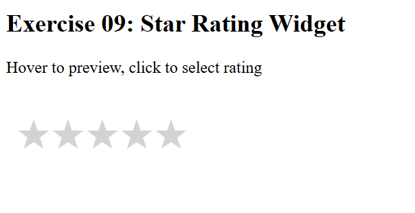
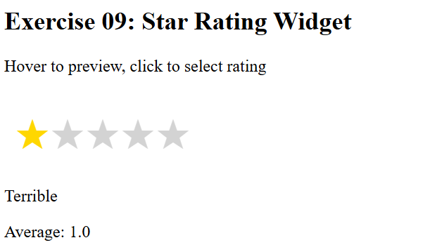
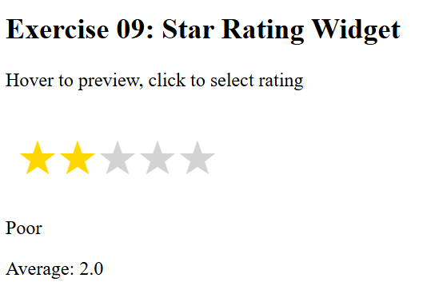
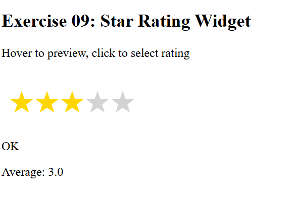
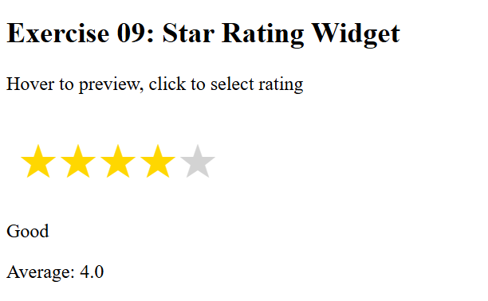
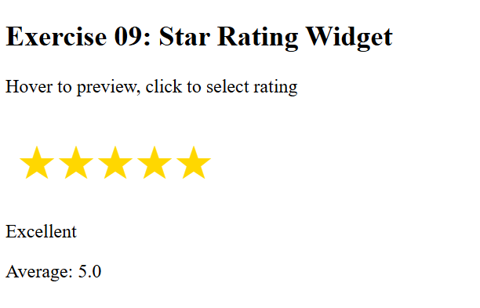

# Exercise 9: Star Rating Widget

## ◆ Problem

Build a star rating system with hover preview, click selection, and average rating calculation.

## ◆ Approach

* Dynamically create stars using DOM
* Use events for hover, click, and keyboard
* Store ratings in an array
* Calculate average using reduce()

## ◆ Concepts Used

* DOM Manipulation
* Events (mouseover, click, keydown)
* Arrays
* reduce()
* classList

## ◆ Code Explanation

### highlightStars()

Highlights stars based on index

### getRatingLabel()

Returns text label for rating

### updateAverage()

Calculates average rating

## ◆ How to Run

1. Open index.html
2. Hover stars → preview
3. Click → lock rating
4. Check average

## ◆ Example Behavior

* Hover 3 → highlights 3 stars
* Click → locks rating
* Multiple clicks → updates average

## ◆ Notes

* Keyboard accessible (Arrow keys + Enter)
* No external libraries used
* Fully interactive UI

