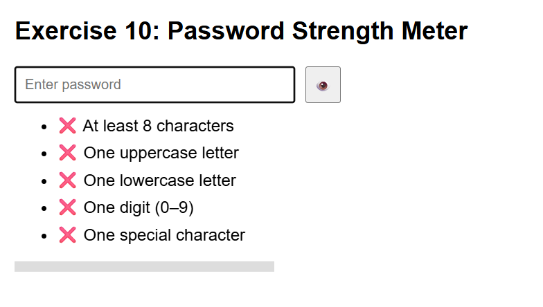
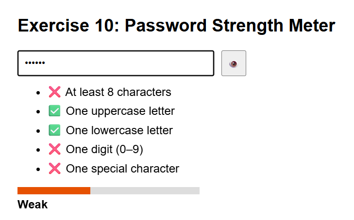
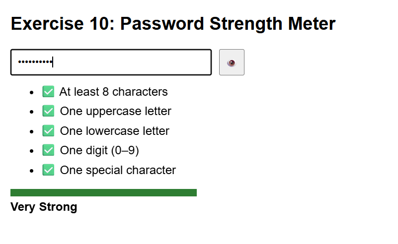

# Exercise 10: Password Strength Meter

## ◆ Problem

Build a password strength checker that evaluates rules in real-time.

## ◆ Approach

* Use regex for validation
* Track score based on passed rules
* Update UI dynamically (rules + bar + label)

## ◆ Concepts Used

* Regex
* DOM Manipulation
* Events
* Dynamic styling

## ◆ Features

* Real-time validation
* Strength indicator (Weak → Very Strong)
* Progress bar
* Show/Hide password toggle

## ◆ How to Run

1. Open index.html
2. Type password
3. Observe strength updates

## ◆ Example

Password1! → Very Strong
abc → Weak

## ◆ Notes

* Uses 5 validation rules
* UI updates without refresh
* Regex handles pattern matching

