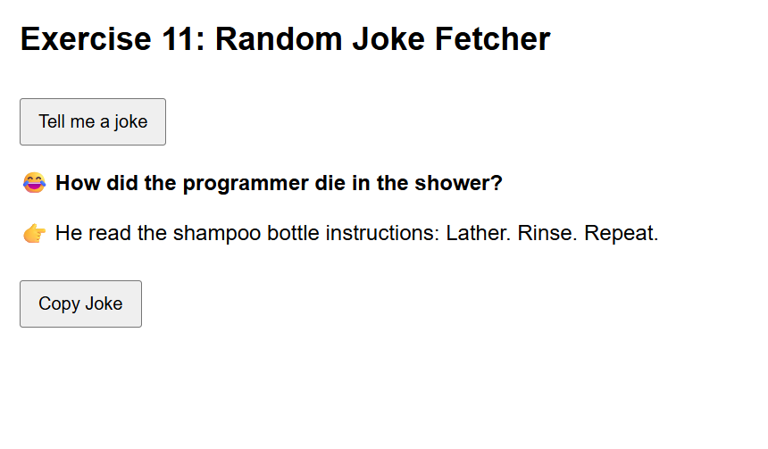

# Exercise 11: Random Joke Fetcher

## ◆ Problem

Build a web app that fetches a random joke from an API when a button is clicked.
The app must handle loading, success, and error states properly.

---

## ◆ Approach

* Use Fetch API with async/await to request data
* Show a loading indicator while fetching
* Display joke in two steps:

  * Setup immediately
  * Punchline after a delay (1.5s)
* Handle API failures using try/catch
* Provide fallback jokes when API fails
* Add a copy-to-clipboard feature

---

## ◆ Concepts Used

* Fetch API
* Async / Await
* Error Handling (try/catch)
* DOM Manipulation
* Event Handling
* setTimeout (for delay)
* Clipboard API

---

## ◆ Features

### ✔ Loading State

* Button is disabled during fetch
* "Loading..." spinner is shown

### ✔ Success State

* Setup is displayed first
* Punchline appears after 1.5 seconds (comic timing)

### ✔ Error Handling

* If API fails or internet is off, fallback joke is shown
* No blank screen or crash

### ✔ Copy Feature

* "Copy Joke" button copies full joke to clipboard

---

## ◆ API Used

https://v2.jokeapi.dev/joke/Programming?type=twopart

* Provides structured jokes (setup + delivery)
* More reliable than random joke APIs

---

## ◆ Code Explanation

### fetchJoke()

* Fetches joke from API
* Checks response status
* Returns structured joke
* Falls back to predefined joke if error occurs

### Button Click Flow

1. Disable button
2. Show loading spinner
3. Fetch joke
4. Display setup
5. Delay → show punchline
6. Enable button

---

## ◆ How to Run

1. Open `index.html` in a browser
2. Click "Tell me a joke"
3. View setup and punchline

---

## ◆ Example Output

Why do programmers hate nature?
👉 It has too many bugs.

---

## ◆ Improvements Made

* Replaced low-quality API with JokeAPI
* Added fallback jokes for reliability
* Improved UI with delay and emoji indicators
* Prevented weak/empty joke outputs

---

## ◆ Notes

* Uses async JavaScript for real-world API handling
* Demonstrates loading, success, and error states
* Designed for better user experience

---

