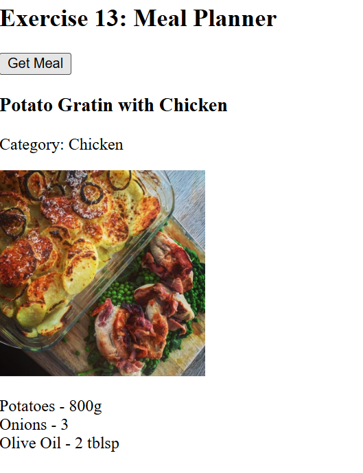
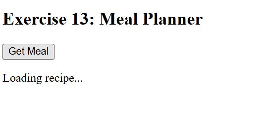

Ex 13: Meal Planner (Promise Chain)
◆ 1. What you’re building (simple)

You are doing 3 dependent API calls:

Step 1 → Get category  
Step 2 → Get meal from that category  
Step 3 → Get full recipe  

Each depends on the previous → that’s why we use Promise chaining

# Exercise 13: Meal Planner (Promise Chain)

## ◆ Problem

Build a meal planner that fetches:

1. A random category
2. A meal from that category
3. Full recipe details

---

## ◆ Approach

* Chain multiple API calls
* Each step depends on previous result
* Implement using:

  * Promise chaining (.then)
  * Async/Await

---

## ◆ Concepts Used

* Promises
* Async/Await
* Fetch API
* Error Handling
* DOM Manipulation

---

## ◆ Flow

1. Fetch categories
2. Pick random category
3. Fetch meals in that category
4. Pick random meal
5. Fetch meal details

---

## ◆ Promise Chain vs Async/Await

### Promise Chain

* Uses `.then()`
* Sequential chaining

### Async/Await

* Cleaner syntax
* Easier to read

---

## ◆ Features

* Loading messages for each step
* Random meal selection
* Displays:

  * Meal name
  * Category
  * Image
  * First 3 ingredients

---

## ◆ How to Run

1. Open index.html
2. Click "Get Meal"

---

## ◆ Example Output

Meal Name: Chicken Curry
Category: Chicken
Ingredients:

* Chicken - 500g
* Onion - 2
* Spices - mix

---

## ◆ Error Handling

* If any API fails → error message shown
* Prevents app crash

---

## ◆ Key Learning

* Chaining dependent API calls
* Difference between Promise chaining and async/await
* Managing async flow in real apps

---

 ->The message appears here like fetching food , recipe, then loading.