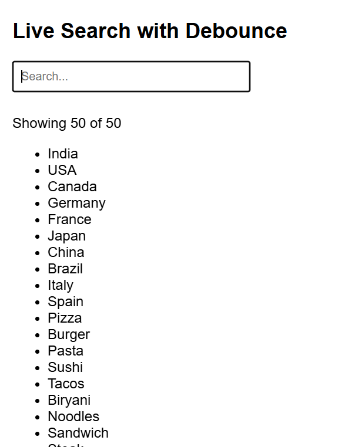
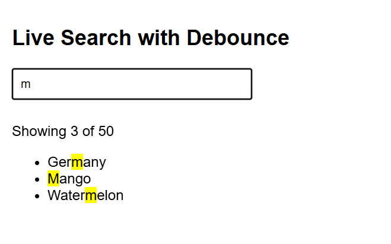

# Exercise 14: Live Search Filter with Debounce

## ◆ Problem

Build a live search feature that filters a list of 50 items as the user types.
The filtering should not run on every keystroke — it must use a debounce mechanism to delay execution.

---

## ◆ Approach

* Render 50 predefined items on page load
* Capture user input using the `input` event
* Use a custom `debounce()` function to delay filtering
* Filter items using `includes()` (case-insensitive)
* Highlight matching text using `<mark>`
* Update result count dynamically

---

## ◆ Concepts Used

* DOM Manipulation
* Event Handling
* Arrays (`filter`, `includes`)
* Debounce (custom implementation)
* Regular Expressions (RegExp)

---

## ◆ Debounce Function

```js id="c9lq2z"
function debounce(fn, delay) {
  let timer;

  return function (...args) {
    clearTimeout(timer);
    timer = setTimeout(() => fn(...args), delay);
  };
}
```

### ◆ Explanation

* Every time user types, previous timer is cleared
* New timer starts
* Function runs only after user stops typing for 300ms

---

## ◆ Filtering Logic

```js id="7ybm0r"
const hits = items.filter(item =>
  item.toLowerCase().includes(query.toLowerCase())
);
```

* Converts both item and query to lowercase
* Ensures case-insensitive search

---

## ◆ Highlight Logic

```js id="r8xqz1"
const highlighted = item.replace(
  new RegExp(query, "gi"),
  match => `<mark>${match}</mark>`
);
```

* Uses RegExp to find matching text
* Wraps match inside `<mark>` tag

---

## ◆ Features

✔ Live search filtering
✔ Debounced execution (300ms delay)
✔ Result count display
✔ Highlight matched text
✔ Handles empty and no-result cases

---

## ◆ How to Run

1. Open `index.html` in a browser
2. Start typing in the search box
3. Observe filtered results

---

## ◆ Example Behavior

Typing quickly:

* Only one filter operation runs after typing stops

Typing "an":

* Highlights matches like:

  * C<mark>an</mark>ada
  * B<mark>an</mark>ana

---

## ◆ Output Cases

| Input    | Output           |
| -------- | ---------------- |
| Empty    | Showing 50 of 50 |
| Match    | Showing X of 50  |
| No match | Showing 0 of 50  |

---

## ◆ Key Learning

* Debounce improves performance by reducing unnecessary function calls
* Efficient UI updates using filtering and DOM manipulation
* RegExp enables dynamic text highlighting

---

## ◆ Notes

* Debounce is implemented manually (not using libraries)
* Suitable for real-world features like search bars, auto-suggestions

---
  - all
  - It should show where anol this text or letters appear.
