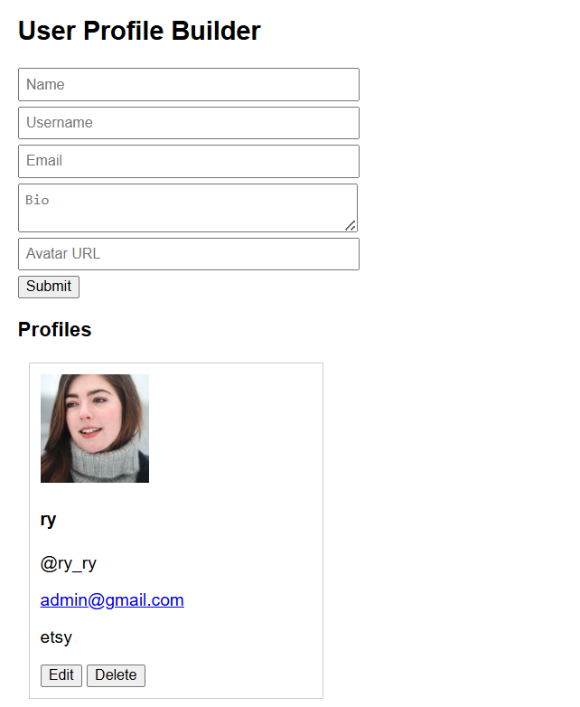

# Exercise 15: User Profile Card Builder

## ◆ Problem

Build a form that collects user details and generates a profile card.
The app must validate all inputs, verify avatar images, and support editing and deleting cards.

---

## ◆ Features

✔ Form validation (all fields)
✔ Inline error messages
✔ Avatar handling (image + fallback)
✔ Profile card creation
✔ Edit existing card
✔ Delete card with confirmation

---

## ◆ Fields & Validation Rules

| Field      | Rule                                   |
| ---------- | -------------------------------------- |
| Name       | 2–50 characters                        |
| Username   | Alphanumeric + underscore (3–20 chars) |
| Email      | Must include `@` and `.`               |
| Bio        | Maximum 160 characters                 |
| Avatar URL | Must be a valid URL                    |

---

## ◆ Validation Logic

```js id="7z4x1p"
if (!/^[a-zA-Z0-9_]{3,20}$/.test(username)) {
  // invalid username
}
```

* Uses regex for username validation
* Uses `new URL()` for URL validation
* Displays inline error messages per field

---

## ◆ Avatar Handling (Important)

Instead of blocking submission using unreliable API checks:

```js id="o1b8hh"

```

### ◆ Why?

* Some valid image URLs fail programmatic checks
* This ensures:

  * Valid images load normally
  * Invalid images fall back safely

---

## ◆ Card Structure

Each profile card displays:

* Avatar image
* Name
* @username
* Email (mailto link)
* Bio
* Edit button
* Delete button

---

## ◆ Edit Functionality

* Clicking **Edit** fills the form with existing data
* Submitting updates the same card (not creating a new one)

---

## ◆ Delete Functionality

```js id="c2l5tp"
if (confirm("Delete this profile?")) {
  card.remove();
}
```

* Removes card from UI
* Uses confirmation dialog

---

## ◆ How to Run

1. Open `index.html` in browser
2. Fill the form
3. Submit to create profile
4. Use Edit/Delete buttons

---

## ◆ Example Avatar URL

```text id="p1d8so"
https://i.pravatar.cc/150?img=5
```

---

## ◆ Key Learning

* Form validation with multiple rules
* Handling user input safely
* Dynamic DOM creation
* Managing UI state (create vs edit)
* Practical handling of external resources (images)

---

## ◆ Notes

* Strict avatar validation via fetch was avoided due to browser limitations
* Fallback image ensures consistent UI
* Focus is on usability + reliability

---





